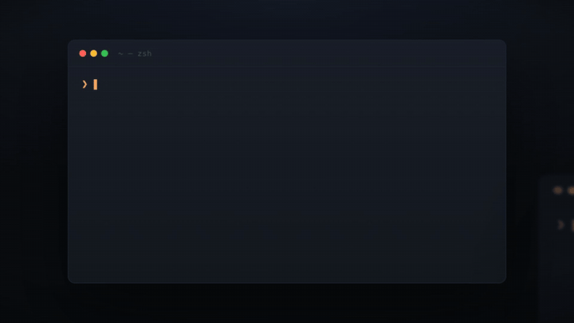

# scrollback

**The open-source admin plane for every coding agent.**

**English** · [简体中文](README.zh-CN.md)

[](https://www.npmjs.com/package/sam-scrollback)
[](LICENSE)
[](#why-scrollback)
[](https://nodejs.org)

One search box across the conversation history of every agent you run —
Claude Code, Codex, Devin, OpenCode, Qwen Code, Gemini CLI, Kimi Code,
Factory Droid, Continue, Copilot CLI, Cursor, Zed, Copilot Chat,
Cline/Roo/Kilo, Trae, Qoder, CodeBuddy, Aider, Goose, Antigravity,
Amp, Cline CLI.

Local-first: a query scans the stores in place. Secrets are redacted at
read time. One honest limit: Trae CN keeps transcripts in an encrypted,
server-synced store — there scrollback surfaces session cwd + sent
prompts, not the full history.

<p align="center">
  
</p>

## Why scrollback

| | scrollback | deja-vu | claude-mem | agent mail |
|---|---|---|---|---|
| Reads existing sessions | ✓ | ✓ | ✗ | ✗ |
| Index / daemon required | ✗ (scans in place) | index | index + LLM per call | — |
| Devin · Trae · Qoder · CodeBuddy | ✓ | ✗ | ✗ | ✗ |
| Wires itself into every agent | ✓ `install` | partial | manual | manual |
| Agent↔agent comms | ✓ `channel` | ✗ | ✗ | ✓ |

## Install

```bash
npm i -g sam-scrollback    # needs Node >= 22.13 (node:sqlite)
scrollback install         # auto-wire skills + MCP into detected agents
```

`scrollback install` detects which agents you have and writes a `SKILL.md`
into their skills dir plus an `mcpServers.scrollback` entry where the config
format is known — every agent gains recall. Preview with `--dry-run`.

For agents that speak MCP directly:

```json
{ "mcpServers": { "scrollback": { "command": "scrollback", "args": ["--mcp"] } } }
```

## Commands

```bash
scrollback doctor                              # detected sources + counts
scrollback projects [--since YYYY-MM-DD]       # rank project cwds by activity
scrollback list [--global|--cwd p] [--since D] # enumerate sessions
scrollback search "<keywords>" [--global] [--platform p]
scrollback context <id> [--grep kw] [--turns N] [--around N] [--from N --to N]
scrollback extract <id> [--grep kw] [--json]
scrollback --mcp                               # MCP server over stdio
```

```bash
scrollback search "landing page" --global --since 2026-08-01
scrollback context 94aa7e8b --grep "landing" --turns 3
```

Every storage root can be overridden with `SCROLLBACK_<PLATFORM>_ROOT`
(`:`-separated for multiple).

Channels — the admin plane itself, data in `~/.scrollback/channels`:

```bash
scrollback channel create <name> [--global] [--desc d] [--type chat|forum]
scrollback channel send <name> "<body>" [--to w] [--by b] [--kind k] [--key k]
scrollback channel read|watch|wait <name> [--from seq] [--kinds a,b]
scrollback inbox <worker> [--channel c] [--all] [--mark]
scrollback workers [--alive]                 # fleet view: state per worker
scrollback spawn <claude|codex> "<task>" [--channel c]
```

## Roadmap

- **fleet** — every agent on one screen

Design and competitive notes: [docs/channel-design.md](docs/channel-design.md) ·
[docs/competitive.md](docs/competitive.md)

## Contributing

New platform support is one adapter file in `src/sources/` implementing
`roots()` + `sessions(root)`, plus a fixture under `fixtures/` and a
conformance test in `test/sources.test.ts`.

```bash
node scrollback.ts <command>   # dev entry, Node 23.6+ type-stripping
npm run build && npm test      # tsc → dist/, 17 conformance tests
```

## License

[MIT](LICENSE)
